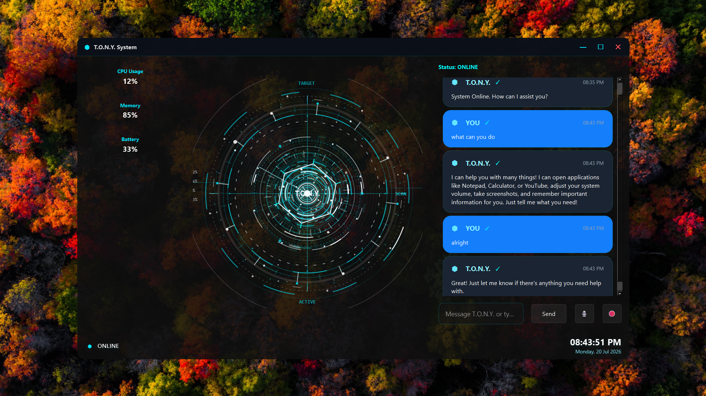
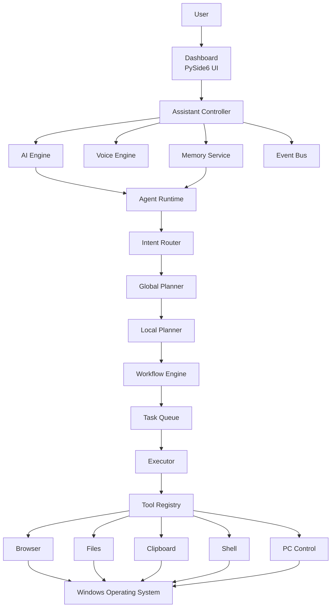

# 🤖 T.O.N.Y. v4

<p align="center">
  <b>An Agentic AI Desktop Assistant inspired by J.A.R.V.I.S.</b>
</p>

<p align="center">
  Voice Interaction • Long-Term Memory • Autonomous Planning • Desktop Automation • Modern Holographic UI
</p>

---

## 📖 Overview

T.O.N.Y. (Technologically Optimized Neural Yielder) v4 is a next-generation desktop AI assistant built entirely in Python.

Unlike traditional chatbots, T.O.N.Y. is designed as an **Agentic AI Assistant** capable of understanding goals, planning tasks, remembering context, interacting through voice, and automating desktop operations.

T.O.N.Y. v4 combines conversational AI, autonomous task planning, persistent memory, voice interaction, desktop automation, and a futuristic holographic interface into a unified modular platform. Built using a layered architecture, each subsystem has a dedicated responsibility, making the project scalable, maintainable, and easy to extend.
---


# 📂 Project Structure

```text
TONY-v4/
│
├── core/
│   ├── agent/
│   │   ├── agent.py
│   │   ├── executor.py
│   │   ├── goal.py
│   │   ├── local_planner.py
│   │   ├── planner.py
│   │   ├── router.py
│   │   ├── runtime.py
│   │   ├── task.py
│   │   ├── task_queue.py
│   │   ├── tool.py
│   │   ├── tool_registry.py
│   │   ├── workflow.py
│   │   ├── workflow_engine.py
│   │   ├── workflow_state.py
│   │   └── workflow_step.py
│   │
│   ├── ai.py
│   ├── assistant.py
│   ├── command_parser.py
│   ├── event_bus.py
│   ├── logger.py
│   ├── memory.py
│   ├── service_manager.py
│   ├── state.py
│   ├── voice.py
│   └── workers.py
│
├── modules/
│   ├── automation.py
│   ├── memory_manager.py
│   ├── pc_control.py
│   ├── system_monitor.py
│   └── web_tools.py
│
├── renderers/
│   ├── core.py
│   ├── particles.py
│   ├── radar.py
│   ├── rings.py
│   ├── telemetry.py
│   └── waveform.py
│
├── tools/
│   ├── browser_tool.py
│   ├── clipboard_tool.py
│   ├── file_tool.py
│   ├── memory_tool.py
│   ├── pc_control_tool.py
│   ├── process_tool.py
│   ├── shell_tool.py
│   └── system_tool.py
│
├── widgets/
│   ├── __init__.py
│   ├── chat_bubble.py
│   ├── glass_panel.py
│   ├── jarvis_hud.py
│   ├── status_bar.py
│   ├── telemetry_card.py
│   └── title_bar.py
│
├── assets/
│   └── screenshots/
│       └── dashboard.png
│
├── dashboard.py
├── config.py
├── main.py
├── requirements.txt
├── README.md
├── TONY_OS.spec
└── Threads.md
```

# 💡 Why T.O.N.Y.?

Most desktop assistants execute one command at a time—they respond to a prompt and stop.

T.O.N.Y. v4 is designed with a different philosophy. Instead of acting as a simple chatbot, it behaves as an **agentic desktop AI** capable of understanding user goals, planning multi-step workflows, remembering previous interactions, and interacting with the operating system through a modular execution pipeline.

The project combines conversational intelligence, long-term memory, autonomous planning, voice interaction, desktop automation, and a modern holographic interface into a single extensible platform.

### What makes T.O.N.Y. different?

- 🧠 Goal-oriented reasoning instead of single-step responses
- ⚡ Autonomous task planning and execution
- 💬 Persistent long-term memory for personalized interactions
- 🎙️ Natural voice conversations
- 🖥️ Direct desktop automation through modular tools
- 🏗️ Production-oriented architecture designed for scalability and maintainability
- 🎨 Futuristic J.A.R.V.I.S.-inspired interface built with PySide6

T.O.N.Y. is built as an experimental foundation for exploring the future of personal AI assistants that can **reason, remember, plan, and act** rather than simply answer questions.


# ✨ Features

- 🧠 Agentic AI Architecture
- 💬 Natural Language Conversations
- 🎙️ Voice Recognition
- 🔊 AI Speech Response
- 🧠 Persistent Long-Term Memory
- 📂 File & Folder Access
- 🖥️ Desktop Automation
- ⚡ Autonomous Task Planning
- 📊 Live System Monitoring
- 🌐 Internet-enabled AI Responses
- 🎨 Futuristic Holographic HUD
- ⚙️ Modular Production Architecture

---

# 🖼️ Screenshots

# Dashboard

<p align="center">
  
</p>

<p align="center">
  <i>Main dashboard showcasing the holographic HUD, live telemetry, conversation panel, and desktop AI interface.</i>
</p>


# 🏗️ Layered System Architecture

T.O.N.Y. v4 follows a layered, event-driven architecture where each subsystem has a dedicated responsibility. User interaction flows through the dashboard, into the assistant controller, through the AI and agent pipeline, and finally to desktop tools that interact with the operating system.



# 🔄 Request Workflow

Every request follows a structured execution pipeline to ensure consistent processing and modularity.

```text
User

↓

Dashboard receives command

↓

Assistant Controller processes request

↓

AI Engine understands intent

↓

Memory retrieves relevant context

↓

Agent Runtime creates an execution plan

↓

Planner breaks goal into executable tasks

↓

Executor performs each task

↓

Tools interact with Windows

↓

Assistant receives the result

↓

Dashboard updates the interface

↓

Voice Engine speaks the response
```

# 🧩 Core Components

| Component | Responsibility |
|-----------|----------------|
| Dashboard | Main application window and user interaction |
| Widgets | Reusable interface components such as HUD, chat panel, telemetry cards, and status bar |
| Assistant Controller | Central coordinator that manages all subsystems |
| AI Engine | Processes prompts and generates intelligent responses |
| Voice Engine | Handles speech recognition and text-to-speech |
| Memory System | Stores and retrieves long-term conversation context |
| Agent Runtime | Converts user goals into executable workflows |
| Planner | Breaks complex goals into smaller tasks |
| Executor | Executes planned tasks in sequence |
| Tool Layer | Provides access to operating system functionality |
| Modules | Backend services such as monitoring and automation |
| Renderers | Draw the holographic HUD and visual effects |

# 📁 Folder Overview

| Folder | Purpose |
|---------|---------|
| **core/** | Core application logic including AI, voice, memory, assistant controller, workers, and the agent runtime |
| **modules/** | Backend services such as automation, system monitoring, memory management, and desktop control |
| **renderers/** | Rendering engine responsible for the radar, rings, particles, waveform, and telemetry animations |
| **tools/** | Desktop capability layer providing browser, file, clipboard, shell, process, and PC control tools |
| **widgets/** | Reusable PySide6 user interface components used throughout the dashboard |

# 🛠 Tech Stack

| Category | Technologies |
|----------|--------------|
| **Programming Language** | Python 3.12+ |
| **GUI Framework** | PySide6 (Qt) |
| **Artificial Intelligence** | Google Gemini |
| **Voice Recognition** | SpeechRecognition |
| **Speech Synthesis** | Windows SAPI |
| **Desktop Automation** | PyAutoGUI, Windows APIs |
| **System Monitoring** | psutil |
| **Storage** | SQLite |
| **Version Control** | Git & GitHub |

# 🏛️ Design Principles

T.O.N.Y. v4 is built around a modular architecture where each subsystem has a clearly defined responsibility.

- **Separation of Concerns** – User interface, AI, memory, rendering, and desktop automation are isolated into independent modules.
- **Modularity** – New tools, widgets, and agent capabilities can be integrated without affecting the overall architecture.
- **Maintainability** – Components communicate through well-defined interfaces, making the project easier to understand, test, and extend.
- **Scalability** – The layered design allows future expansion, including vision support, plugin systems, multi-agent workflows, and cross-platform compatibility.


# 🚀 Installation

## 1. Clone the Repository

```bash
git clone https://github.com/sakshamm2/TONY-v4.git
```

## 2. Navigate to the Project

```bash
cd TONY-v4
```

## 3. Install Dependencies

```bash
pip install -r requirements.txt
```

## 4. Launch T.O.N.Y.

```bash
python main.py
```


# ▶️ Getting Started

After launching T.O.N.Y., you can interact using either voice commands or text input.

The assistant automatically:

- Processes natural language requests
- Retrieves relevant memory
- Plans multi-step tasks when required
- Executes desktop actions
- Displays results in the dashboard
- Responds using synthesized speech


  # 💬 Example Commands

| User Command | T.O.N.Y. Action |
|--------------|-----------------|
| Open Calculator | Launches the Calculator application |
| Open Chrome | Starts Google Chrome |
| Create a folder named Projects | Creates a folder on the desktop |
| Search Python tutorials | Opens browser with search results |
| What's my CPU usage? | Displays live system statistics |
| Remember that my favorite language is Python | Stores information in long-term memory |
| What do you remember about me? | Retrieves stored memories |
| Tell me today's date | Returns the current system date |
| Open Downloads folder | Opens File Explorer in Downloads |


---

# 🎯 Current Capabilities

T.O.N.Y. v4 is currently capable of:

### 🤖 Artificial Intelligence
- Natural language conversations
- Context-aware responses
- Goal-oriented reasoning
- Intent understanding

### 🧠 Memory System
- Persistent long-term memory
- Context retrieval
- Memory management
- Conversation continuity

### 🎙️ Voice Interaction
- Speech recognition
- AI voice responses
- Hands-free interaction

### 🖥️ Desktop Automation
- Open applications
- Execute system commands
- File & folder management
- Browser automation
- Clipboard operations
- Process management

### 📊 Live Monitoring
- CPU usage
- RAM usage
- Disk information
- System telemetry

### 🎨 User Interface
- Modern holographic HUD
- Glassmorphism dashboard
- Live telemetry cards
- Animated visual effects
- Real-time status indicators

---

# 📈 Roadmap

## Completed

- [x] Modern PySide6 Dashboard
- [x] Holographic HUD
- [x] Conversational AI
- [x] Voice Recognition
- [x] AI Speech Synthesis
- [x] Persistent Memory
- [x] Desktop Automation
- [x] Agent Runtime
- [x] Modular Architecture
- [x] Live System Monitoring

## Planned

- [ ] Computer Vision
- [ ] Multi-Agent Collaboration
- [ ] Plugin Marketplace
- [ ] Smart Workflow Builder
- [ ] Calendar & Email Integration
- [ ] Cross-Platform Support
- [ ] Mobile Companion Application
- [ ] Cloud Memory Synchronization

---

# 🔮 Future Vision

T.O.N.Y. v4 is designed as a foundation for a truly autonomous personal AI assistant. While the current version focuses on desktop intelligence and task execution, the long-term vision is to evolve T.O.N.Y. into an adaptive, context-aware digital companion capable of assisting across devices and environments.

## 🧠 Advanced Cognitive Capabilities

- Multi-agent collaboration
- Long-term episodic memory
- Semantic knowledge graph
- Personalized reasoning and preferences
- Self-reflection and performance optimization

---

## 👁️ Multimodal Intelligence

- Computer vision
- Screen understanding
- OCR and document analysis
- Image reasoning
- Camera integration

---

## 🖥️ Desktop Intelligence

- Autonomous workflow automation
- Intelligent file organization
- Background task execution
- Application orchestration
- Cross-application automation

---

## 🌐 Cloud & Connectivity

- Cloud memory synchronization
- Cross-device continuity
- Calendar integration
- Email management
- Knowledge base synchronization

---

## 🧩 Extensible Platform

- Plugin ecosystem
- Third-party tool integration
- Custom workflows
- API support
- Community extensions

---

## 🤖 Toward a True AI Companion

The long-term goal is to transform T.O.N.Y. from a desktop assistant into an intelligent software companion capable of understanding context, learning from experience, planning independently, and collaborating with users to accomplish complex real-world tasks.


# 🚀 Evolution Roadmap

### ✅ T.O.N.Y. v4
- Agentic desktop assistant
- Long-term memory
- Voice interaction
- Desktop automation
- Planning engine

### 🔄 T.O.N.Y. v5
- Vision
- Plugin SDK
- Workflow editor
- Multi-agent coordination

### 🌍 T.O.N.Y. v6
- Cross-device synchronization
- Cloud intelligence
- Mobile companion
- Distributed memory

### 🧠 T.O.N.Y. X
- Continual learning
- Autonomous research
- Personal knowledge graph
- Persistent digital companion

T.O.N.Y. is not intended to be another chatbot. It is an ongoing exploration of what a modern personal AI assistant can become when reasoning, memory, planning, voice interaction, and desktop automation are combined into a unified architecture.

# 🤝 Contributing

Contributions are welcome and appreciated.

If you would like to contribute:

1. Fork the repository.
2. Create a new feature branch.

```bash
git checkout -b feature/my-feature
```

3. Commit your changes.

```bash
git commit -m "Add new feature"
```

4. Push the branch.

```bash
git push origin feature/my-feature
```

5. Open a Pull Request.

Please ensure that all code follows the existing project architecture and coding style.

---

# 📄 License

This project is licensed under the **MIT License**.

You are free to use, modify, and distribute this software under the terms of the MIT License.

---

# 👨‍💻 Author

## Saksham

**Computer Science Engineering Student**

Developer of **T.O.N.Y. v4** — an agentic desktop AI assistant focused on conversational intelligence, autonomous task execution, desktop automation, and modern interface design.

GitHub:
https://github.com/sakshamm2

---

# ⭐ Support the Project

If you found this project useful or interesting:

⭐ Star the repository

🐛 Report bugs

💡 Suggest new features

🤝 Contribute to development

---

<p align="center">

### Thank you for checking out T.O.N.Y. v4!

**If you enjoyed this project, consider giving it a ⭐ on GitHub.**

</p>


# 📌 Project Statistics


